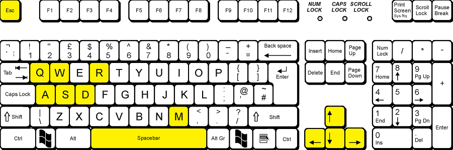

**Authors:** Juraj Marcin, Peter Tóth

**Language:** Unity3D, UnityScript (JavaScript), C#

## Game controls
- `ESCAPE` - back to menu (in menu exits game)
- `W` or `UP ARROW` - acceleration
- `S` or `DOWN ARROW` - breaking and reverse
- `D` or `RIGHT ARROW` - steer right
- `A` or `LEFT ARROW` - steer right
- `SPACE` - handbrake
- `Q` - change view
- `M` - toggle map
- `R` - rotate car to default rotation

